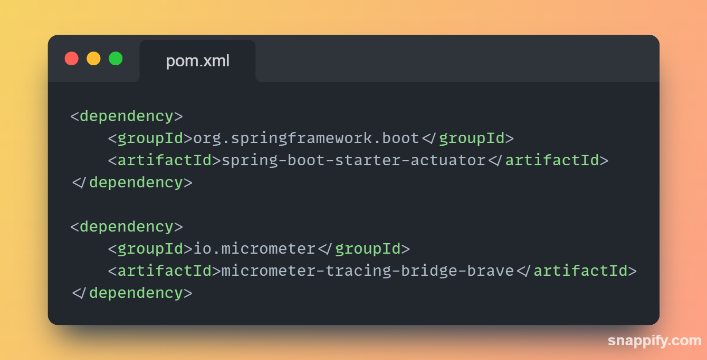
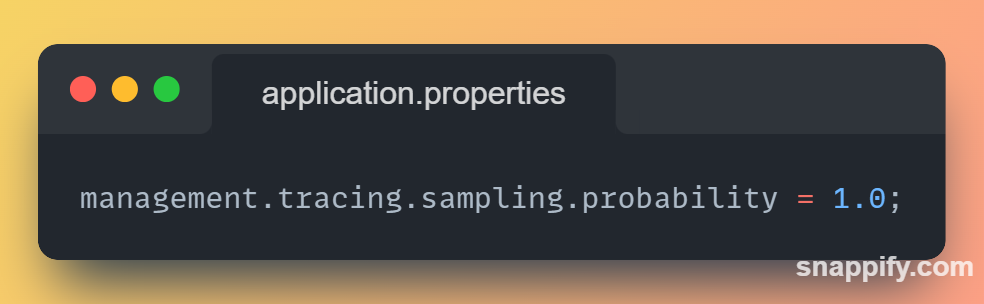
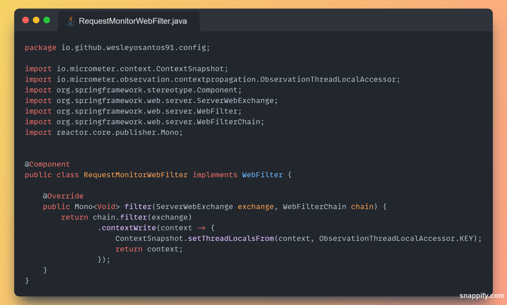
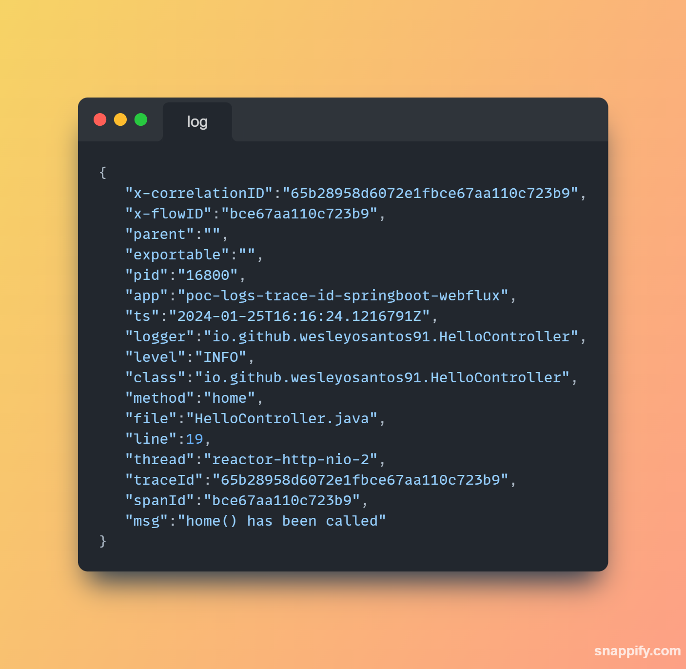

# Rastreamento distribuído com Spring Boot 3.x.x: migrando do Spring Cloud Sleuth para o Micrometer

> Hoje vou falar sobre uma solução para um problema que pode ocorrer ao atualizar um projeto Spring WebFlux ou Spring MVC e conjunto Spring Sleuth usando Spring Boot 2.x.x para Spring Boot 3.x.x.

> Ao atualizar para o Spring Boot 3, o projeto Spring Cloud Sleuth, que fornece rastreamento distribuído, é removido do trem de versões. No entanto, o núcleo do projeto Sleuth é movido para o projeto Micrometer Tracing.

> Isso significa que, se você estiver usando o Spring Cloud Sleuth em seu projeto Spring Boot 2.x.x, precisará fazer algumas alterações para que ele funcione corretamente no Spring Boot 3.x.x.

> A principal mudança é que que precisa fazer alteração da dependência do Spring Cloud Sleuth para as dependências Micrometer tracinng e Spring Actuator. O Actuator fornece suporte para o Micrometer, que é usado pelo Spring Boot 3 para rastreamento distribuído.

> ## Dependência necessário na versão Spring Boot 2.x.x

> ## Dependência necessário na versão Spring Boot 3.x.x

> Para projetos Spring MVC, a configuração padrão é suficiente para a migração. No entanto, para projetos Spring WebFlux, é necessária uma configuração adicional. Essa foi a motivação para compartilhar esse artigo com a comunidade. Pesquisando no GitHub, encontrei várias Issues relatando esse problema ao realizar a atualização. Após alguns testes, consegui resolver o problema aplicando a classe de configuração conforme mostrado na imagem abaixo.

>
> Como podemos ver na imagem abaixo com ajustes aplicado a aplicação com Spring webflux volta a gerar o tracings.

A imagem mostra o log gerando tracings nos logs.

> Bom pessoal espero que tenham gostado a baixo segue as as referencias e o código de exemplo.

> Referencias:

- https://spring.io/blog/2022/10/12/observability-with-spring-boot-3/
- https://www.baeldung.com/spring-boot-3-observability
- https://github.com/spring-projects/spring-boot/issues/33372
